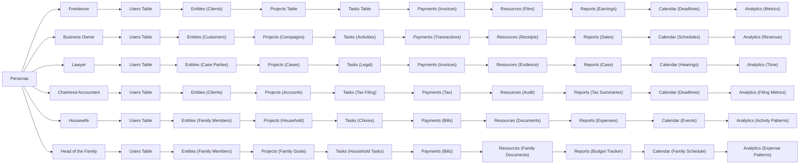

```mermaid
flowchart LR
    Root["Personas"] --> Freelancer["Freelancer"] & Business["Business Owner"] & Lawyer["Lawyer"] & CA["Chartered Accountant"] & Housewife["Housewife"] & HeadFamily["Head of the Family"]

    %% Freelancer tables
    Freelancer --> FU["Users Table"]
    FU --> FE["Entities (Clients)"]
    FE --> FP["Projects Table"]
    FP --> FT["Tasks Table"]
    FT --> FPay["Payments (Invoices)"]
    FPay --> FR["Resources (Files)"]
    FR --> FRep["Reports (Earnings)"]
    FRep --> FCal["Calendar (Deadlines)"]
    FCal --> FAn["Analytics (Metrics)"]

    %% Business Owner tables
    Business --> BU["Users Table"]
    BU --> BE["Entities (Customers)"]
    BE --> BP["Projects (Campaigns)"]
    BP --> BT["Tasks (Activities)"]
    BT --> BPay["Payments (Transactions)"]
    BPay --> BR["Resources (Receipts)"]
    BR --> BRep["Reports (Sales)"]
    BRep --> BCal["Calendar (Schedules)"]
    BCal --> BAn["Analytics (Revenue)"]

    %% Lawyer tables
    Lawyer --> LU["Users Table"]
    LU --> LE["Entities (Case Parties)"]
    LE --> LP["Projects (Cases)"]
    LP --> LT["Tasks (Legal)"]
    LT --> LPay["Payments (Invoices)"]
    LPay --> LR["Resources (Evidence)"]
    LR --> LRep["Reports (Case)"]
    LRep --> LCal["Calendar (Hearings)"]
    LCal --> LAn["Analytics (Time)"]

    %% CA tables
    CA --> CU["Users Table"]
    CU --> CE["Entities (Clients)"]
    CE --> CP["Projects (Accounts)"]
    CP --> CT["Tasks (Tax Filing)"]
    CT --> CPay["Payments (Tax)"]
    CPay --> CR["Resources (Audit)"]
    CR --> CRep["Reports (Tax Summaries)"]
    CRep --> CCal["Calendar (Deadlines)"]
    CCal --> CAn["Analytics (Filing Metrics)"]

    %% Housewife tables
    Housewife --> HU["Users Table"]
    HU --> HE["Entities (Family Members)"]
    HE --> HP["Projects (Household)"]
    HP --> HT["Tasks (Chores)"]
    HT --> HPay["Payments (Bills)"]
    HPay --> HR["Resources (Documents)"]
    HR --> HRep["Reports (Expenses)"]
    HRep --> HCal["Calendar (Events)"]
    HCal --> HAn["Analytics (Activity Patterns)"]

    %% Head of the Family tables
    HeadFamily --> HFU["Users Table"]
    HFU --> HFE["Entities (Family Members)"]
    HFE --> HFP["Projects (Family Goals)"]
    HFP --> HFT["Tasks (Household Tasks)"]
    HFT --> HFPay["Payments (Bills)"]
    HFPay --> HFR["Resources (Family Documents)"]
    HFR --> HFRep["Reports (Budget Tracker)"]
    HFRep --> HFCal["Calendar (Family Schedule)"]
    HFCal --> HFAn["Analytics (Expense Patterns)"]

```
